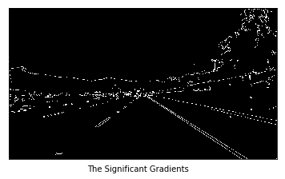

# **Finding Lane Lines on the Road** 

## Writeup

---

**Finding Lane Lines on the Road**

The goals / steps of this project are the following:
* Make a pipeline that finds lane lines on the road
* Reflect on your work in a written report

---

### Reflection

### 1. Describe your pipeline. As part of the description, explain how you modified the draw_lines() function.

My pipeline consisted of 5 steps. 
Before running the pipeline, I'd clear a memory of sorts of previous lane lines and their slopes.

1. Then, to begin with, I would read in the relevant image images to grayscale and use the GaussianBlur() function from the cv2 library with a kernel size of three to counter noise in the image data.

2. Next, I applied a Canny transform, also using a function (Canny()) from the cv2 library. Through this step, I selected all possibly relevant edges, which, in this case, are significant gradients, with a low threshold of 50 and a high threshold of 150. The result of this is illustrated below.

3. Then I selected a quadrilateral region of interest, defined based on the image dimensions. This mask, if you will, was used to determine which of the previously found gradients (i.e., in step (2)) are relevant. The result of this is illustrated below.

4. Next, I drew in the Hough lines based loosely on the gradients. For this, I also used a function in the cv2 library; namely, HoughLinesP(), with a rho parameter of 1, a theta parameter of pi/180, a threshold of 50 to account for the fact that lane markings may fade and leave less "evidence" of lane markings, a minimum line length of 100, and a maximum line gap of 160 to account for the fact that lane markings may fade and thus leave greater space between lane markings. The result of this is illustrated below.

5. Finally, I weighted the original, full-color image with the Hough lines drawn in step (4). To accomplish this, I used the addWeighted() function in the cv2 library and selected an alpha parameter of 0.8, a beta parameter of 1.0, and a lambda parameter of 0.0. The result of this is illustrated below.

In order to draw a single line on the left and right lanes, I modified the draw_lines() function by extrapolating lane lines from average slopes and positions detected and adjusting said extrapolations with respect to saved values in order to introduce a degree of consistency.

Specifically, I calculated the slope of each detected line segment and classified the line segment as belonging to the left or right lane line based on its positivity. Line segments with unreasonable slopes may be useless noise and were ignored.

* Before: 
* After: 

The slope of each lane (i.e., left and right) was calculated as the mean of the slopes of the corresponding line segments whereas the fundamental lane position was calculated as the mean of the corresponding line segment coordinates. Both values were adjusted based on previously recorded values to introduce consistency between frames (the deduced lane markings were quite jittery before this feature was introduced). To see this, refer to the output video titled challenge.mp4.

After each calculation, the calculated values were saved in global variables. Before the processing of each video clip, these values would be cleared so as to address interference.

### 2. Identify potential shortcomings with your current pipeline

One potential shortcoming would be what would happen when lane lines are strongly curved (i.e., somewhat parabolic and very much non-linear). The lines drawn so as to extend from the horizon to the bottom of the screen are exactly linear. In the recordings used, lane lines were linear or nearly so, but it is feasible that one may encounter roads that are not so, and in such cases, the deduced lane lines would not be accurate.

Another shortcoming could be that obvious lane markings are assumed. It could be the case that lane markings are quite faded or inclement weather interferes with the vision of such markings, and in these cases, the relevant lane markings would not be inferred.

Finally, a possible shortcoming could stem from weighting the prior lane markings so heavily. It is conceivable that the position and nature of lane markings could drastically change within a short span of time. The consequences of the pipeline in conjunction with such a possibility is ameliorated by the fact that videos may have high temporal resolution (i.e., fps). It remains to be seen whether this potential shortcoming is significant and further testing (e.g., in "the real world") must be conducted to decide if this shortcoming is significant.

### 3. Suggest possible improvements to your pipeline

A possible improvement would be, in accordance with the first potential shortcoming, to incorporate the detection of polynomial lane markings - i.e., in the case of curved lanes.

Another potential improvement could be to utilize information of previous trips in the same geographic location. Such would be invaluable if the lane markings are not visible - e.g., if the markings significantly faded and/or if there is currently inclement weather in the area.
